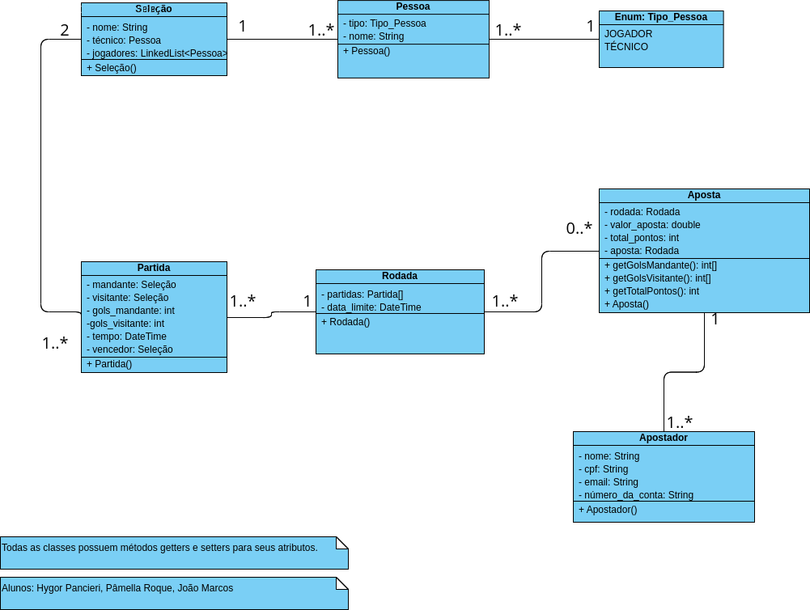

# Programação Orientada a Objetos I
## Trabalho 1º Bimestre
#

### Aluno: [Hygor Oliveira Pancieri](https://github.com/HPancieri)
### Professor: [Otávio Lube dos Santos](https://github.com/otaviolube)
#

Arquivos do trabalho de POO 1 com a modelagem das classes necessárias para a construção de um bolão da copa do mundo, bem como a implementação na linguagem Java.

#
